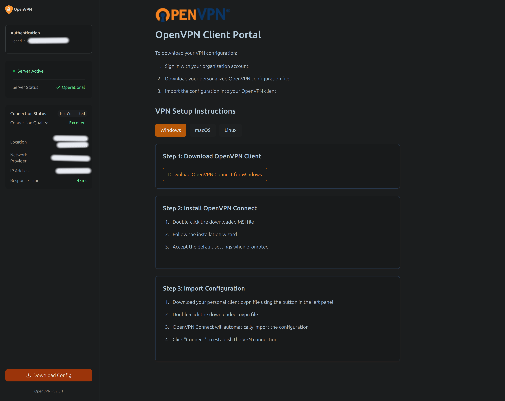

# 🔐 OpenVPN Authentication Portal

[](https://www.python.org/downloads/) [](https://flask.palletsprojects.com/) [](https://opensource.org/licenses/MIT) [](https://codecov.io/gh/ranson21/gcp-ovpn-portal)

A secure, user-friendly authentication portal for OpenVPN configuration distribution. This application provides Google OAuth2 authentication and domain-restricted access to OpenVPN configuration files.



## 🌟 Features

- 🔒 Secure Google OAuth2 authentication
- 👥 Domain-restricted access control
- 📦 Automated OpenVPN config generation
- 🎨 Clean, responsive web interface
- 🚀 Easy deployment and configuration

## 📦 Installation

### Via pip

```bash
pip install gcp-ovpn-portal
```

### Development Setup

1. Clone the repository:
```bash
git clone https://github.com/ranson21/gcp-ovpn-portal
cd gcp-ovpn-portal
```

2. Install with Poetry:
```bash
poetry install
```

## 🔧 Configuration

### Google OAuth2 Setup

1. Go to the [Google Cloud Console](https://console.cloud.google.com/)
2. Create a new project or select an existing one
3. Enable the Google OAuth2 API:
   - Go to "APIs & Services" > "Library"
   - Search for "Google OAuth2"
   - Click "Enable"
4. Configure the OAuth consent screen:
   - Go to "APIs & Services" > "OAuth consent screen"
   - Choose "Internal" if using Google Workspace, or "External" if not
   - Fill in the application name and other required fields
   - Add the necessary scopes (email, profile)
5. Create OAuth 2.0 credentials:
   - Go to "APIs & Services" > "Credentials"
   - Click "Create Credentials" > "OAuth client ID"
   - Choose "Web application"
   - Add authorized redirect URIs:
     - For local development: `http://localhost:8081`
     - For production: `https://your-domain.com`
   - Save your Client ID and Client Secret

### Environment Variables

The following environment variables are required:

- `CLIENT_ID`: Google OAuth2 client ID (obtained from steps above)
- `ALLOWED_DOMAIN`: Authorized email domain (e.g., "company.com")
- `EXTERNAL_IP`: VPN server's external IP address
- `OPENVPN_DIR`: Directory containing OpenVPN configuration files (default: /etc/openvpn)

Create a .env file:
```bash
cp .env.example .env
# Edit .env with your configuration
```

Example .env file:
```
CLIENT_ID=your-google-client-id.apps.googleusercontent.com
ALLOWED_DOMAIN=yourcompany.com
EXTERNAL_IP=203.0.113.1
OPENVPN_DIR=/etc/openvpn
```

## 🚀 Usage

### Running as an installed package

```bash
# Run the VPN portal
ovpn-portal
```

### Running in development mode

```bash
# Using Poetry
poetry run ovpn-portal

# Or using make
make run
```

## 📁 Project Structure

```
openvpn-auth-portal/
├── ovpn_portal/
│   ├── app/
│   │   ├── main/
|   │   │   ├── __init__.py
|   │   │   └── routes.py
│   │   ├── __init__.py
│   │   ├── config.py
│   │   ├── middleware.py
│   │   └── vpn.py
│   └── run.py
├── static/
│   ├── css/
│   ├── images/
│   ├── js/
│   └── favicon.ico
├── templates/
│   └── index.html
├── tests/
├── pyproject.toml
├── .env.example
├── .gitignore
└── README.md
```

## 🛠️ Development

The project includes a Makefile to help with common development tasks:

### First Time Setup
```bash
make dev-setup    # Install Poetry, initialize git, and install dependencies
```

### Common Commands
```bash
make install      # Install project dependencies
make run         # Run development server
make test        # Run test suite
make coverage    # Run tests with coverage report
make format      # Format code with black and isort
make lint        # Run linting checks
make clean       # Clean temporary files and builds
```

### Test Coverage

To run tests with coverage reporting:
```bash
make coverage
```

This will:
- Run all tests with coverage tracking
- Generate a terminal report showing missing lines
- Create an HTML coverage report in `coverage_html/`

View the HTML coverage report:
```bash
make coverage-open  # On macOS
# Or open coverage_html/index.html in your browser
```

### Package Management
```bash
make build       # Build package distribution
make develop     # Install package locally in editable mode
```

### Publishing
```bash
make publish-test  # Publish to Test PyPI
make publish      # Publish to PyPI
```

You can also use Poetry directly for development tasks:
```bash
poetry install    # Install dependencies
poetry run pytest # Run tests
poetry run black . # Format code
poetry run flake8 # Lint code
```

## 🔒 Security Considerations

- All authentication is performed through Google OAuth2
- Configuration files are generated temporarily and immediately deleted after download
- Domain restriction ensures only authorized users can access the portal
- HTTPS is required in production

## 📄 License

This project is licensed under the MIT License - see the [LICENSE](LICENSE) file for details.

## 🤝 Contributing

Contributions are welcome! Please feel free to submit a Pull Request.

## 👤 Author

Abigail Ranson
- Website: [abbyranson.com](https://abbyranson.com)
- GitHub: [@ranson21](https://github.com/ranson21)